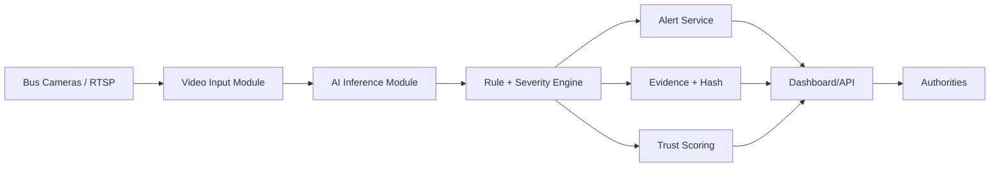

# System Architecture

```mermaid
flowchart LR
  C[Bus Cameras / RTSP] --> V[Video Input Module]
  V --> I[AI Inference Module]
  I --> R[Rule + Severity Engine]
  R --> A[Alert Service]
  R --> E[Evidence + Hash]
  R --> T[Trust Scoring]
  A --> D[Dashboard/API]
  E --> D
  T --> D
  D --> O[Authorities]
```

## Security

- JWT authentication
- TOTP 2FA verification gate
- Role-based authorization (`admin`, `operator`)
- Evidence hashing (SHA-256) and chained audit records
